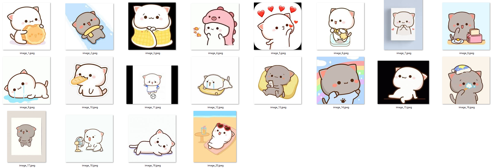
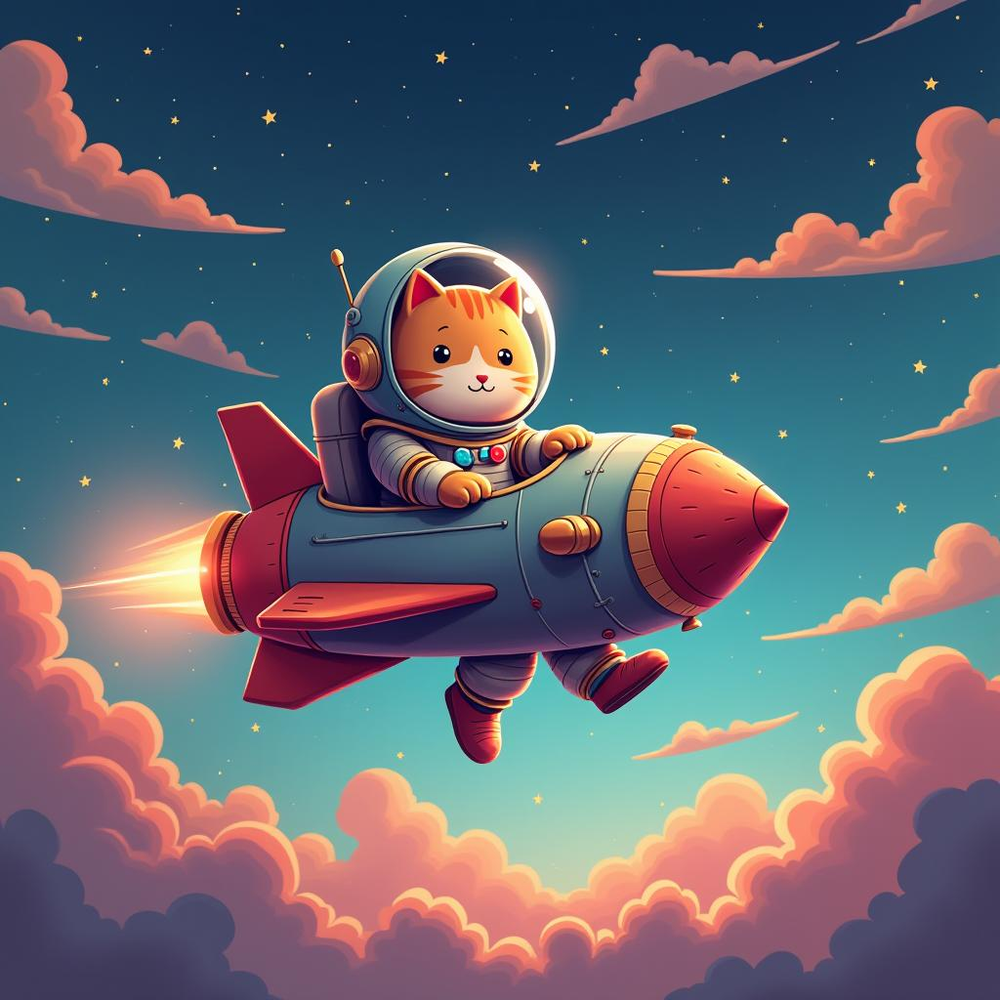

# 🐾 **Fine-Tuning FLUX.1 to Learn Mochicat**

This project showcases how I fine-tuned the `FLUX.1-dev` image generation model using the [ai-toolkit](https://github.com/ostris/ai-toolkit) to teach it a new character: **Mochicat**, a cute cartoon cat that the original model was unfamiliar with.

Special thanks to [@1y33](https://github.com/1y33) for being my brainstorming buddy and researching available tools for fine-tuning this model. 

### 🎯 Goal

To inject a visually consistent and stylized character into the model, enabling prompts like "Mochicat baking cookies" or "Mochicat as an astronaut" to produce faithful and creative outputs.

---

## 📁 Dataset

I curated a dataset of **20 Mochicat images** and wrote detailed captions using a language model. Each caption described the pose, emotion, and unique visual traits of Mochicat.  

Examples of a caption describing the first image is provided below.

> *"A plump, adorable white cartoon Mochicat with soft pink ears and rosy cheeks happily hugging and nibbling on a golden-brown, round cookie decorated with a smiling face. Mochicat's eyes sparkle joyfully, showing satisfaction and delight."*

All images were paired with `.txt` files named identically to the image files, following ai-toolkit's training requirements.

---

## 🧪 Training Setup

- **Base Model:** [`black-forest-labs/FLUX.1-dev`](https://huggingface.co/black-forest-labs/FLUX.1-dev)
- **Trigger Word:** `[trigger]` (set to `mochicat_style` in config)
- **Steps:** 1500
- **Resolution Buckets:** 512, 768, 1024
- **Device:** AMD MI300X

Training was done using [ai-toolkit](https://github.com/ostris/ai-toolkit), leveraging LoRA and multi-resolution support for efficient fine-tuning.

---

## 🖼️ Before & After Examples

Each example uses the same prompt evaluated at different training steps.

---

### Prompt  
**"Mochicat happily baking cookies in a cozy kitchen, flour flying everywhere"**

| Step 0 | Step 250 | Step 1500 |
|--------|----------|------------|
|  |  |  |
| *Before training* | *Early character learning* | *Identity established* |

---

### Prompt  
**"Mochicat dressed as a detective, investigating mysterious paw prints at night"**

| Step 0 | Step 250 | Step 1500 |
|--------|----------|------------|
|  |  |  |
| *Before training* | *Early character learning* | *Identity established* |

---

### Prompt  
**"Mochicat as an astronaut, floating peacefully outside a colorful spaceship"**

| Step 0 | Step 250 | Step 1500 |
|--------|----------|------------|
|  |  |  |
| *Before training* | *Early character learning* | *Identity established* |

---

### Prompt  
**"Mochicat excitedly riding a skateboard through a lively park"**

| Step 0 | Step 250 | Step 1500 |
|--------|----------|------------|
|  |  |  |
| *Before training* | *Early character learning* | *Identity established* |

---

## 🛠️ Tools Used

- [ai-toolkit](https://github.com/ostris/ai-toolkit)
- AMD MI300X

---

## 📍 Try It Yourself

Installation steps on MI300X coming soon.
